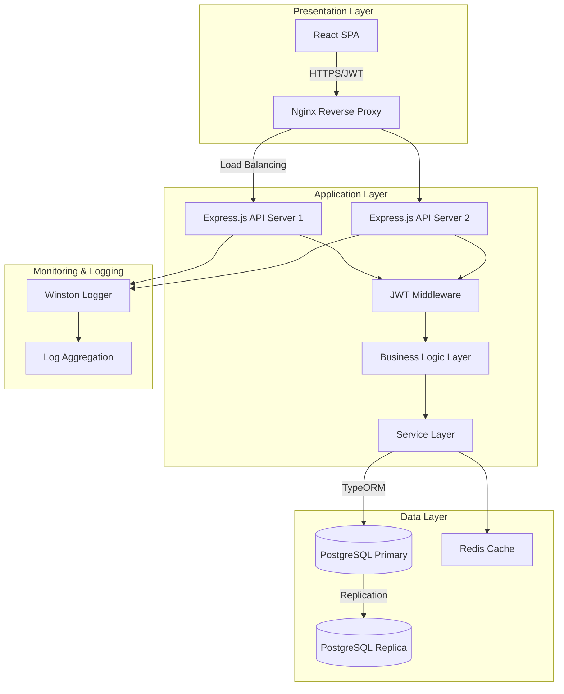
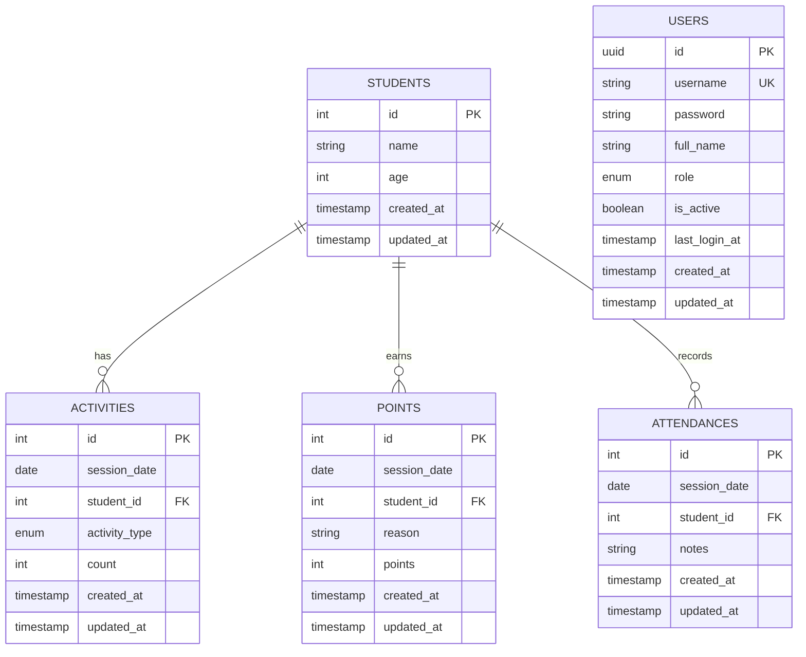
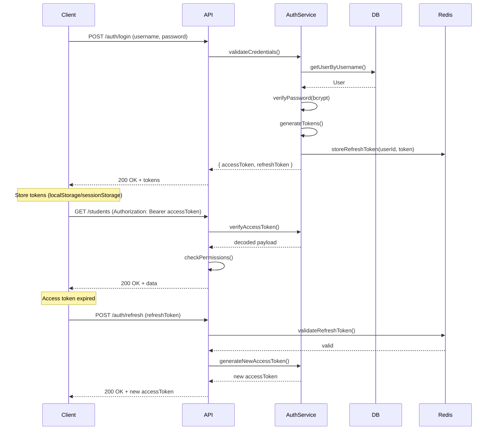
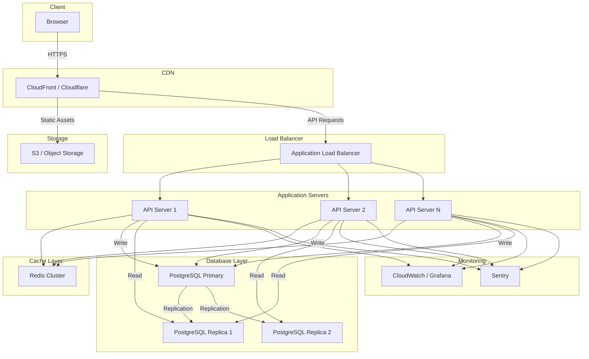

# وثيقة التصميم التقني - نظام إدارة الطلاب

## Overview

### نظرة عامة على النظام

نظام إدارة الطلاب هو تطبيق ويب حديث مبني على معمارية **Client-Server** منفصلة، يوفر إدارة شاملة لبيانات الطلاب ونشاطاتهم وحضورهم مع آلية تقسيم ذكية. يعتمد النظام على التقنيات التالية:

- **Frontend**: React 18+ مع TypeScript لضمان Type Safety
- **Backend**: Node.js 18 LTS مع Express.js 4.x
- **Database**: PostgreSQL 14+ لضمان ACID Compliance
- **State Management**: Redux Toolkit للحالات المعقدة وContext API للحالات البسيطة
- **UI Framework**: Material-UI (MUI) v5 مع دعم RTL كامل
- **Authentication**: JWT (JSON Web Tokens) مع Refresh Token Strategy
- **ORM**: TypeORM لإدارة قاعدة البيانات بطريقة آمنة ومنظمة

### الأهداف الرئيسية للتصميم

1. **الفصل التام بين الطبقات**: معمارية ثلاثية الطبقات (Presentation، Business Logic، Data Access)
2. **الأمان**: تطبيق أفضل ممارسات الأمان (HTTPS، JWT، Password Hashing، Input Validation)
3. **الأداء**: استخدام Connection Pooling، Caching، Pagination، وIndexing
4. **قابلية التوسع**: تصميم modular يسمح بإضافة ميزات جديدة بسهولة
5. **تجربة المستخدم**: واجهة عربية كاملة مع دعم RTL وتصميم متجاوب
6. **الموثوقية**: معالجة الأخطاء بشكل شامل مع Logging ومراقبة

## Architecture

### معمارية النظام العامة

يتبع النظام معمارية **Three-Tier Architecture** مع فصل واضح بين المسؤوليات:



### Frontend Architecture

تعتمد الواجهة الأمامية على معمارية **Feature-Based Structure** مع تطبيق مبادئ **Clean Architecture**:

```
src/
├── app/
│   ├── store.ts              # Redux Store Configuration
│   └── rootReducer.ts        # Root Reducer
├── features/
│   ├── students/
│   │   ├── components/       # Student-specific components
│   │   ├── pages/           # Student pages
│   │   ├── services/        # API calls
│   │   ├── slices/          # Redux slices
│   │   └── types/           # TypeScript types
│   ├── activities/
│   ├── points/
│   ├── attendance/
│   └── auth/
├── shared/
│   ├── components/          # Shared components (Table, Form, etc.)
│   ├── hooks/              # Custom hooks
│   ├── utils/              # Utility functions
│   ├── types/              # Shared types
│   └── constants/          # Constants
├── config/
│   ├── i18n.ts             # i18next configuration
│   ├── theme.ts            # MUI theme with RTL
│   └── api.ts              # API client configuration
└── layouts/
    ├── MainLayout.tsx
    └── AuthLayout.tsx
```

**Key Design Decisions:**

1. **Redux Toolkit** للحالات المعقدة (Students، Activities، Points، Attendance)
2. **Context API** للحالات البسيطة (Theme، Language، User Session)
3. **React Query** للـ Data Fetching وال Caching على مستوى Client
4. **React Hook Form** + **Yup** للتحقق من صحة النماذج
5. **Material-UI** مع تخصيص Theme لدعم RTL والألوان العربية

### Backend Architecture

يتبع الخادم معمارية **Layered Architecture** مع فصل واضح:

```
src/
├── app.ts                   # Express app configuration
├── server.ts                # Server entry point
├── config/
│   ├── database.ts          # TypeORM configuration
│   ├── jwt.ts               # JWT configuration
│   └── redis.ts             # Redis configuration
├── modules/
│   ├── students/
│   │   ├── student.entity.ts      # TypeORM Entity
│   │   ├── student.controller.ts  # Route handlers
│   │   ├── student.service.ts     # Business logic
│   │   ├── student.repository.ts  # Data access
│   │   ├── student.dto.ts         # Data Transfer Objects
│   │   └── student.routes.ts      # Express routes
│   ├── activities/
│   ├── points/
│   ├── attendance/
│   └── auth/
├── shared/
│   ├── middleware/
│   │   ├── auth.middleware.ts     # JWT verification
│   │   ├── error.middleware.ts    # Error handling
│   │   ├── validation.middleware.ts
│   │   └── rateLimit.middleware.ts
│   ├── utils/
│   │   ├── logger.ts              # Winston logger
│   │   ├── crypto.ts              # Password hashing
│   │   └── response.ts            # Standard response format
│   └── types/
└── database/
    └── migrations/
```

**Key Design Decisions:**

1. **Service Layer Pattern**: فصل Business Logic عن Controllers
2. **Repository Pattern**: تجريد Data Access Layer
3. **DTO Pattern**: التحقق من صحة البيانات القادمة والصادرة
4. **Dependency Injection**: استخدام Constructor Injection للتبعيات
5. **Error Handling Middleware**: معالجة مركزية للأخطاء

### Database Architecture

استراتيجية قاعدة البيانات:

1. **Primary Database**: PostgreSQL للقراءة والكتابة
2. **Read Replicas**: نسخ للقراءة فقط لتوزيع الحمل
3. **Connection Pooling**: استخدام pg-pool مع max 20 connections
4. **Migrations**: استخدام TypeORM Migrations لإدارة Schema Changes
5. **Backup Strategy**: نسخ احتياطية يومية مع Point-in-Time Recovery

### API Design

يتبع النظام مبادئ **RESTful API** مع معايير موحدة:

**Response Format:**
```typescript
interface ApiResponse<T> {
  success: boolean;
  data?: T;
  error?: {
    code: string;
    message: string;
    details?: any;
  };
  meta?: {
    page?: number;
    limit?: number;
    total?: number;
  };
}
```

**Status Codes:**
- 200: Success (GET، PUT)
- 201: Created (POST)
- 204: No Content (DELETE)
- 400: Bad Request
- 401: Unauthorized
- 403: Forbidden
- 404: Not Found
- 422: Validation Error
- 500: Internal Server Error

## Components and Interfaces

### Frontend Components

#### Core Components

**1. DataTable Component**
```typescript
interface DataTableProps<T> {
  columns: Column<T>[];
  data: T[];
  loading: boolean;
  pagination: PaginationConfig;
  onEdit: (row: T) => void;
  onDelete: (row: T) => void;
  onSort: (field: keyof T, direction: 'asc' | 'desc') => void;
  onSearch: (query: string) => void;
  rtl?: boolean;
}
```

**2. FormDialog Component**
```typescript
interface FormDialogProps {
  open: boolean;
  title: string;
  onClose: () => void;
  onSubmit: (data: any) => Promise<void>;
  fields: FormField[];
  initialValues?: any;
  validationSchema: Yup.Schema;
}
```

**3. StudentDivider Component** (للتقسيم الذكي)
```typescript
interface StudentDividerProps {
  attendanceId: string;
  students: Student[];
  onDivisionComplete: (division: DivisionResult) => void;
}

interface DivisionResult {
  totalCount: number;
  categoryA?: {
    students: Student[];
    groups: Student[][];
  };
  categoryB?: {
    students: Student[];
    groups: Student[][];
  };
}
```

#### Feature-Specific Components

**Students Feature:**
- `StudentList.tsx`: عرض جدول الطلاب
- `StudentForm.tsx`: نموذج إضافة/تعديل طالب
- `StudentCard.tsx`: عرض بطاقة طالب

**Activities Feature:**
- `ActivityList.tsx`: عرض جدول النشاطات
- `ActivityForm.tsx`: نموذج إضافة/تعديل نشاط
- `ActivityTypeSelector.tsx`: اختيار نوع النشاط

**Attendance Feature:**
- `AttendanceList.tsx`: عرض جدول الحضور
- `AttendanceForm.tsx`: نموذج تسجيل الحضور مع Checkboxes
- `AttendanceDivision.tsx`: عرض نتائج التقسيم

### Backend Interfaces

#### Entity Interfaces

**1. Student Entity**
```typescript
@Entity('students')
export class Student {
  @PrimaryGeneratedColumn()
  id: number;

  @Column({ type: 'varchar', length: 100 })
  name: string;

  @Column({ type: 'integer' })
  age: number;

  @CreateDateColumn()
  createdAt: Date;

  @UpdateDateColumn()
  updatedAt: Date;

  @OneToMany(() => Activity, activity => activity.student)
  activities: Activity[];

  @OneToMany(() => Point, point => point.student)
  points: Point[];

  @OneToMany(() => Attendance, attendance => attendance.student)
  attendances: Attendance[];
}
```

**2. Activity Entity**
```typescript
@Entity('activities')
export class Activity {
  @PrimaryGeneratedColumn()
  id: number;

  @Column({ type: 'date' })
  sessionDate: Date;

  @ManyToOne(() => Student, student => student.activities, { eager: true })
  @JoinColumn({ name: 'student_id' })
  student: Student;

  @Column({ 
    type: 'enum', 
    enum: ['ضغط', 'ثابت', 'تحمل'] 
  })
  activityType: ActivityType;

  @Column({ type: 'integer' })
  count: number;

  @CreateDateColumn()
  createdAt: Date;

  @UpdateDateColumn()
  updatedAt: Date;
}
```

**3. Point Entity**
```typescript
@Entity('points')
export class Point {
  @PrimaryGeneratedColumn()
  id: number;

  @Column({ type: 'date' })
  sessionDate: Date;

  @ManyToOne(() => Student, student => student.points, { eager: true })
  @JoinColumn({ name: 'student_id' })
  student: Student;

  @Column({ type: 'varchar', length: 255 })
  reason: string;

  @Column({ type: 'integer' })
  points: number;

  @CreateDateColumn()
  createdAt: Date;

  @UpdateDateColumn()
  updatedAt: Date;
}
```

**4. Attendance Entity**
```typescript
@Entity('attendances')
export class Attendance {
  @PrimaryGeneratedColumn()
  id: number;

  @Column({ type: 'date' })
  sessionDate: Date;

  @ManyToOne(() => Student, student => student.attendances, { eager: true })
  @JoinColumn({ name: 'student_id' })
  student: Student;

  @Column({ type: 'text', nullable: true })
  notes: string;

  @CreateDateColumn()
  createdAt: Date;

  @UpdateDateColumn()
  updatedAt: Date;
}
```

**5. User Entity** (للمصادقة)
```typescript
@Entity('users')
export class User {
  @PrimaryGeneratedColumn('uuid')
  id: string;

  @Column({ type: 'varchar', length: 100, unique: true })
  username: string;

  @Column({ type: 'varchar', length: 255 })
  password: string; // hashed with bcrypt

  @Column({ type: 'varchar', length: 100 })
  fullName: string;

  @Column({ 
    type: 'enum', 
    enum: ['admin', 'teacher', 'viewer'],
    default: 'viewer'
  })
  role: UserRole;

  @Column({ type: 'boolean', default: true })
  isActive: boolean;

  @Column({ type: 'timestamp', nullable: true })
  lastLoginAt: Date;

  @CreateDateColumn()
  createdAt: Date;

  @UpdateDateColumn()
  updatedAt: Date;
}
```

#### Service Interfaces

**1. Division Service**
```typescript
interface DivisionService {
  divideStudents(students: Student[]): DivisionResult;
  applyCategoryRules(count: number): CategoryDivision;
  applyGroupRules(students: Student[]): Student[][];
}

interface CategoryDivision {
  categoryA: number;
  categoryB: number;
}
```

**2. Authentication Service**
```typescript
interface AuthService {
  login(username: string, password: string): Promise<AuthResponse>;
  refreshToken(refreshToken: string): Promise<TokenResponse>;
  validateToken(token: string): Promise<TokenPayload>;
  logout(userId: string): Promise<void>;
}

interface AuthResponse {
  accessToken: string;
  refreshToken: string;
  expiresIn: number;
  user: UserDto;
}
```

#### API Endpoints

**Students API:**
```
GET    /api/v1/students          # List all students (with pagination)
GET    /api/v1/students/:id      # Get student by ID
POST   /api/v1/students          # Create new student
PUT    /api/v1/students/:id      # Update student
DELETE /api/v1/students/:id      # Delete student
```

**Activities API:**
```
GET    /api/v1/activities        # List all activities
GET    /api/v1/activities/:id    # Get activity by ID
POST   /api/v1/activities        # Create new activity
PUT    /api/v1/activities/:id    # Update activity
DELETE /api/v1/activities/:id    # Delete activity
GET    /api/v1/activities/student/:studentId  # Get activities by student
```

**Points API:**
```
GET    /api/v1/points            # List all points
GET    /api/v1/points/:id        # Get point by ID
POST   /api/v1/points            # Create new point
PUT    /api/v1/points/:id        # Update point
DELETE /api/v1/points/:id        # Delete point
GET    /api/v1/points/student/:studentId      # Get points by student
```

**Attendance API:**
```
GET    /api/v1/attendances       # List all attendances
GET    /api/v1/attendances/:id   # Get attendance by ID
POST   /api/v1/attendances/bulk  # Bulk create attendances
PUT    /api/v1/attendances/:id   # Update attendance
DELETE /api/v1/attendances/:id   # Delete attendance
GET    /api/v1/attendances/session/:date      # Get attendances by session
POST   /api/v1/attendances/divide/:date       # Divide students by session
```

**Auth API:**
```
POST   /api/v1/auth/login        # User login
POST   /api/v1/auth/refresh      # Refresh token
POST   /api/v1/auth/logout       # User logout
GET    /api/v1/auth/me           # Get current user
```

## Data Models

### Database Schema

#### Students Table
```sql
CREATE TABLE students (
    id SERIAL PRIMARY KEY,
    name VARCHAR(100) NOT NULL,
    age INTEGER NOT NULL CHECK (age > 0 AND age < 100),
    created_at TIMESTAMP DEFAULT CURRENT_TIMESTAMP,
    updated_at TIMESTAMP DEFAULT CURRENT_TIMESTAMP
);

CREATE INDEX idx_students_name ON students(name);
```

#### Activities Table
```sql
CREATE TABLE activities (
    id SERIAL PRIMARY KEY,
    session_date DATE NOT NULL,
    student_id INTEGER NOT NULL,
    activity_type VARCHAR(20) NOT NULL CHECK (activity_type IN ('ضغط', 'ثابت', 'تحمل')),
    count INTEGER NOT NULL CHECK (count >= 0),
    created_at TIMESTAMP DEFAULT CURRENT_TIMESTAMP,
    updated_at TIMESTAMP DEFAULT CURRENT_TIMESTAMP,
    FOREIGN KEY (student_id) REFERENCES students(id) ON DELETE CASCADE
);

CREATE INDEX idx_activities_student ON activities(student_id);
CREATE INDEX idx_activities_date ON activities(session_date);
CREATE INDEX idx_activities_type ON activities(activity_type);
```

#### Points Table
```sql
CREATE TABLE points (
    id SERIAL PRIMARY KEY,
    session_date DATE NOT NULL,
    student_id INTEGER NOT NULL,
    reason VARCHAR(255) NOT NULL,
    points INTEGER NOT NULL,
    created_at TIMESTAMP DEFAULT CURRENT_TIMESTAMP,
    updated_at TIMESTAMP DEFAULT CURRENT_TIMESTAMP,
    FOREIGN KEY (student_id) REFERENCES students(id) ON DELETE CASCADE
);

CREATE INDEX idx_points_student ON points(student_id);
CREATE INDEX idx_points_date ON points(session_date);
```

#### Attendances Table
```sql
CREATE TABLE attendances (
    id SERIAL PRIMARY KEY,
    session_date DATE NOT NULL,
    student_id INTEGER NOT NULL,
    notes TEXT,
    created_at TIMESTAMP DEFAULT CURRENT_TIMESTAMP,
    updated_at TIMESTAMP DEFAULT CURRENT_TIMESTAMP,
    FOREIGN KEY (student_id) REFERENCES students(id) ON DELETE CASCADE
);

CREATE UNIQUE INDEX idx_attendances_unique ON attendances(session_date, student_id);
CREATE INDEX idx_attendances_date ON attendances(session_date);
```

#### Users Table
```sql
CREATE TABLE users (
    id UUID PRIMARY KEY DEFAULT gen_random_uuid(),
    username VARCHAR(100) UNIQUE NOT NULL,
    password VARCHAR(255) NOT NULL,
    full_name VARCHAR(100) NOT NULL,
    role VARCHAR(20) NOT NULL CHECK (role IN ('admin', 'teacher', 'viewer')),
    is_active BOOLEAN DEFAULT TRUE,
    last_login_at TIMESTAMP,
    created_at TIMESTAMP DEFAULT CURRENT_TIMESTAMP,
    updated_at TIMESTAMP DEFAULT CURRENT_TIMESTAMP
);

CREATE INDEX idx_users_username ON users(username);
CREATE INDEX idx_users_role ON users(role);
```

### Data Relationships



### Division Rules Data

**Category Division Rules (15-36 students):**
```typescript
const CATEGORY_DIVISION_RULES: Record<number, [number, number]> = {
  15: [9, 6],   16: [8, 8],   17: [9, 8],   18: [9, 9],
  19: [10, 9],  20: [10, 10], 21: [12, 9],  22: [12, 10],
  23: [14, 9],  24: [12, 12], 25: [15, 10], 26: [14, 12],
  27: [15, 12], 28: [16, 12], 29: [15, 14], 30: [15, 15],
  31: [16, 15], 32: [16, 16], 33: [18, 15], 34: [18, 16],
  35: [18, 17], 36: [18, 18]
};
```

**Group Division Rules (5-18 students per category):**
```typescript
const GROUP_DIVISION_RULES: Record<number, number[]> = {
  5: [5],
  6: [3, 3],
  7: [7],
  8: [4, 4],
  9: [3, 3, 3],
  10: [5, 5],
  11: [11],
  12: [4, 4, 4],
  13: [13],
  14: [7, 7],
  15: [5, 5, 5],
  16: [4, 4, 4, 4],
  17: [17],
  18: [6, 6, 6]
};
```

### Caching Strategy

**Redis Cache Keys:**
```typescript
// Student list cache (5 minutes)
const CACHE_STUDENTS_LIST = 'students:list:page:{page}:limit:{limit}';

// Student detail cache (10 minutes)
const CACHE_STUDENT_DETAIL = 'student:{id}';

// Attendance by date cache (30 minutes)
const CACHE_ATTENDANCE_BY_DATE = 'attendance:date:{date}';

// Division rules cache (never expires)
const CACHE_DIVISION_RULES = 'division:rules';
```


## Correctness Properties

*الخصائص الصحيحة هي خصائص أو سلوكيات يجب أن تكون صحيحة عبر جميع التنفيذات الصالحة للنظام - في الأساس، هي عبارات رسمية عن ما يجب أن يفعله النظام. تعمل الخصائص كجسر بين المواصفات القابلة للقراءة البشرية وضمانات الصحة القابلة للتحقق الآلي.*

### Property 1: Data Persistence Round-Trip

*لأي* كيان صالح (طالب، نشاط، نقطة، أو حضور)، عند حفظه في قاعدة البيانات ثم استرجاعه، يجب أن تكون البيانات المسترجعة مطابقة للبيانات الأصلية.

**Validates: Requirements 1.6, 2.7, 3.6, 4.6**

### Property 2: ID Preservation on Update

*لأي* كيان موجود في النظام، عند تحديث بياناته، يجب أن يحتفظ المعرف الفريد (ID) بنفس القيمة قبل وبعد التحديث.

**Validates: Requirements 1.5, 2.6, 3.5**

### Property 3: Bulk Attendance Creation

*لأي* مجموعة من الطلاب المحددين في جلسة معينة، عند حفظ الحضور، يجب أن يساوي عدد سجلات الحضور المنشأة عدد الطلاب المحددين.

**Validates: Requirements 4.4**

### Property 4: Category Division Rule Application

*لأي* عدد من الطلاب الحاضرين بين 15 و36 (شاملاً)، يجب أن يطبق النظام قاعدة التقسيم المطابقة لهذا العدد بحيث يكون مجموع عدد طلاب الفئة (أ) وعدد طلاب الفئة (ب) مساوياً للعدد الكلي للطلاب.

**Validates: Requirements 5.3**

### Property 5: Group Division Rule Application

*لأي* فئة تحتوي على عدد من الطلاب بين 5 و18، يجب أن يطبق النظام قاعدة تقسيم المجموعات المطابقة بحيث يكون مجموع أحجام المجموعات مساوياً لعدد الطلاب في الفئة.

**Validates: Requirements 6.2, 6.4**

### Property 6: Division Completeness

*لأي* تقسيم للطلاب إلى فئات ومجموعات، يجب أن يظهر كل طالب حاضر مرة واحدة فقط في إحدى المجموعات، ولا يجوز فقدان أو تكرار أي طالب.

**Validates: Requirements 5.5, 6.5**

### Property 7: Transaction Atomicity

*لأي* معاملة (transaction) تتضمن عمليات متعددة على قاعدة البيانات، عند فشل أي عملية داخل المعاملة، يجب التراجع عن جميع العمليات السابقة (rollback) والعودة إلى الحالة الأصلية قبل بدء المعاملة.

**Validates: Requirements 7.4**

### Property 8: Password Hashing

*لأي* كلمة مرور يتم حفظها في النظام، يجب أن تكون القيمة المخزنة في قاعدة البيانات مختلفة عن كلمة المرور الأصلية (أي يجب أن تكون مشفرة)، ويجب أن تكون عملية التحقق من كلمة المرور قادرة على مطابقة كلمة المرور الأصلية مع القيمة المشفرة.

**Validates: Requirements 10.2**

### Property 9: Protected Endpoint Authorization

*لأي* endpoint محمي في API، عند محاولة الوصول إليه بدون token صالح أو بدون الصلاحيات المطلوبة، يجب أن يرفض النظام الطلب ويعيد status code 401 (Unauthorized) أو 403 (Forbidden) حسب الحالة.

**Validates: Requirements 10.4, 10.6**

### Property 10: Date Formatting Consistency

*لأي* تاريخ يتم عرضه في واجهة المستخدم، يجب أن يكون التنسيق متوافقاً مع المعايير العربية (مثل: YYYY/MM/DD أو DD/MM/YYYY) ومتسقاً عبر جميع أجزاء التطبيق.

**Validates: Requirements 8.3**

## Error Handling

### Frontend Error Handling

**1. API Error Handling**
```typescript
// Centralized error handler
class ApiErrorHandler {
  static handle(error: AxiosError): UserFriendlyError {
    if (error.response) {
      // Server responded with error status
      switch (error.response.status) {
        case 400:
          return new ValidationError(error.response.data);
        case 401:
          return new AuthenticationError('انتهت صلاحية الجلسة. الرجاء تسجيل الدخول مرة أخرى.');
        case 403:
          return new AuthorizationError('ليس لديك صلاحية للقيام بهذا الإجراء.');
        case 404:
          return new NotFoundError('البيانات المطلوبة غير موجودة.');
        case 422:
          return new ValidationError('البيانات المدخلة غير صحيحة.');
        case 500:
          return new ServerError('حدث خطأ في الخادم. الرجاء المحاولة لاحقاً.');
        default:
          return new UnknownError('حدث خطأ غير متوقع.');
      }
    } else if (error.request) {
      // Request was made but no response
      return new NetworkError('تعذر الاتصال بالخادم. الرجاء التحقق من اتصال الإنترنت.');
    } else {
      // Something happened in setting up the request
      return new ClientError(error.message);
    }
  }
}
```

**2. Error Boundaries**
```typescript
// React Error Boundary for catching component errors
class ErrorBoundary extends React.Component<Props, State> {
  static getDerivedStateFromError(error: Error) {
    return { hasError: true, error };
  }

  componentDidCatch(error: Error, errorInfo: React.ErrorInfo) {
    logger.error('Component error:', error, errorInfo);
  }

  render() {
    if (this.state.hasError) {
      return <ErrorFallback error={this.state.error} />;
    }
    return this.props.children;
  }
}
```

**3. Form Validation Errors**
- استخدام Yup للتحقق من صحة النماذج
- عرض رسائل الخطأ بالعربية أسفل كل حقل
- منع إرسال النموذج إذا كانت هناك أخطاء

**4. Toast Notifications**
- استخدام Material-UI Snackbar لعرض الإشعارات
- رسائل نجاح باللون الأخضر
- رسائل خطأ باللون الأحمر
- رسائل تحذير باللون البرتقالي

### Backend Error Handling

**1. Global Error Middleware**
```typescript
export const errorMiddleware = (
  err: Error,
  req: Request,
  res: Response,
  next: NextFunction
) => {
  logger.error('Error:', {
    message: err.message,
    stack: err.stack,
    url: req.url,
    method: req.method,
    body: req.body,
    user: req.user?.id
  });

  if (err instanceof ValidationError) {
    return res.status(422).json({
      success: false,
      error: {
        code: 'VALIDATION_ERROR',
        message: 'البيانات المدخلة غير صحيحة',
        details: err.details
      }
    });
  }

  if (err instanceof AuthenticationError) {
    return res.status(401).json({
      success: false,
      error: {
        code: 'AUTHENTICATION_ERROR',
        message: 'فشل التحقق من الهوية'
      }
    });
  }

  if (err instanceof AuthorizationError) {
    return res.status(403).json({
      success: false,
      error: {
        code: 'AUTHORIZATION_ERROR',
        message: 'ليس لديك صلاحية للقيام بهذا الإجراء'
      }
    });
  }

  if (err instanceof NotFoundError) {
    return res.status(404).json({
      success: false,
      error: {
        code: 'NOT_FOUND',
        message: 'البيانات المطلوبة غير موجودة'
      }
    });
  }

  // Default to 500 server error
  res.status(500).json({
    success: false,
    error: {
      code: 'INTERNAL_SERVER_ERROR',
      message: 'حدث خطأ في الخادم',
      ...(process.env.NODE_ENV === 'development' && { details: err.message })
    }
  });
};
```

**2. Database Error Handling**
```typescript
export const handleDatabaseError = (error: any): never => {
  if (error.code === '23505') {
    // Unique constraint violation
    throw new ValidationError('هذا السجل موجود مسبقاً');
  }
  
  if (error.code === '23503') {
    // Foreign key constraint violation
    throw new ValidationError('لا يمكن حذف هذا السجل لأنه مرتبط بسجلات أخرى');
  }
  
  if (error.code === '23502') {
    // Not null constraint violation
    throw new ValidationError('جميع الحقول المطلوبة يجب أن تكون مملوءة');
  }
  
  logger.error('Database error:', error);
  throw new DatabaseError('حدث خطأ في قاعدة البيانات');
};
```

**3. Validation Error Handling**
```typescript
export const validateRequest = (schema: Joi.Schema) => {
  return (req: Request, res: Response, next: NextFunction) => {
    const { error, value } = schema.validate(req.body, {
      abortEarly: false,
      stripUnknown: true
    });

    if (error) {
      const details = error.details.map(detail => ({
        field: detail.path.join('.'),
        message: translateValidationMessage(detail.message)
      }));

      throw new ValidationError('فشل التحقق من صحة البيانات', details);
    }

    req.body = value;
    next();
  };
};
```

**4. Async Error Handling**
```typescript
// Wrapper for async route handlers
export const asyncHandler = (fn: Function) => {
  return (req: Request, res: Response, next: NextFunction) => {
    Promise.resolve(fn(req, res, next)).catch(next);
  };
};
```

### Database Error Handling

**1. Connection Pool Errors**
- مراقبة عدد الاتصالات النشطة
- إعادة المحاولة عند فشل الاتصال (exponential backoff)
- تسجيل أخطاء الاتصال في logs

**2. Transaction Rollback**
- استخدام try-catch داخل transactions
- rollback تلقائي عند حدوث أي خطأ
- تسجيل تفاصيل الـ rollback

**3. Query Timeout**
- تعيين timeout لكل query (مثلاً 30 ثانية)
- إلغاء الـ query عند التجاوز
- إرجاع خطأ واضح للمستخدم

## Testing Strategy

### Overview

يعتمد النظام على استراتيجية اختبار شاملة تجمع بين:
- **Unit Tests**: للوحدات الفردية والوظائف
- **Property-Based Tests**: للخصائص الشاملة باستخدام fast-check
- **Integration Tests**: للتكامل بين المكونات
- **End-to-End Tests**: لاختبار المسارات الكاملة للمستخدم

### Property-Based Testing Implementation

**Library**: سنستخدم [fast-check](https://github.com/dubzzz/fast-check) لـ JavaScript/TypeScript

**Configuration**: كل property test يجب أن يعمل بحد أدنى **100 iteration**

**Tag Format**: كل property test يجب أن يحتوي على تعليق يربطه بالـ design property:
```typescript
/**
 * Feature: student-management-system, Property 1: Data Persistence Round-Trip
 */
test('should preserve data after save and retrieve cycle', () => {
  fc.assert(
    fc.property(studentArbitrary, async (student) => {
      const saved = await studentRepository.save(student);
      const retrieved = await studentRepository.findById(saved.id);
      expect(retrieved).toEqual(saved);
    }),
    { numRuns: 100 }
  );
});
```

### Frontend Testing

**1. Unit Tests**
- **Framework**: Jest + React Testing Library
- **Coverage Target**: 80% للمكونات
- **Focus Areas**:
  - Component rendering
  - User interactions (clicks، inputs)
  - State management (Redux actions/reducers)
  - Custom hooks
  - Utility functions

**Example:**
```typescript
describe('StudentForm', () => {
  it('should display validation errors for empty name', () => {
    render(<StudentForm />);
    const submitButton = screen.getByRole('button', { name: /حفظ/i });
    fireEvent.click(submitButton);
    expect(screen.getByText(/الاسم مطلوب/i)).toBeInTheDocument();
  });
});
```

**2. Property-Based Tests**
```typescript
/**
 * Feature: student-management-system, Property 10: Date Formatting Consistency
 */
describe('Date Formatting', () => {
  it('should format all dates consistently in Arabic', () => {
    fc.assert(
      fc.property(fc.date(), (date) => {
        const formatted = formatArabicDate(date);
        expect(formatted).toMatch(/^\d{4}\/\d{2}\/\d{2}$/);
      }),
      { numRuns: 100 }
    );
  });
});
```

**3. Component Tests**
- اختبار تفاعل المستخدم مع المكونات
- اختبار عرض البيانات
- اختبار حالات التحميل والأخطاء

**4. Integration Tests**
- اختبار التكامل بين Redux وComponents
- اختبار API calls مع mocked responses
- اختبار Navigation

**5. E2E Tests**
- **Framework**: Playwright أو Cypress
- **Scenarios**:
  - تسجيل الدخول
  - إضافة وتعديل طالب
  - تسجيل حضور وتقسيم الطلاب
  - إضافة نشاط ونقاط

### Backend Testing

**1. Unit Tests**
- **Framework**: Jest
- **Coverage Target**: 85% للـ services و repositories
- **Focus Areas**:
  - Service layer logic
  - Division algorithms
  - Validation functions
  - Utility functions

**Example:**
```typescript
describe('DivisionService', () => {
  it('should divide 15 students into categories A(9) and B(6)', () => {
    const students = createMockStudents(15);
    const result = divisionService.divideStudents(students);
    expect(result.categoryA.students).toHaveLength(9);
    expect(result.categoryB.students).toHaveLength(6);
  });
});
```

**2. Property-Based Tests**

```typescript
/**
 * Feature: student-management-system, Property 1: Data Persistence Round-Trip
 */
describe('Student Repository', () => {
  it('should preserve student data after save and retrieve', async () => {
    fc.assert(
      fc.asyncProperty(
        fc.record({
          name: fc.string({ minLength: 1, maxLength: 100 }),
          age: fc.integer({ min: 5, max: 99 })
        }),
        async (studentData) => {
          const saved = await studentRepository.create(studentData);
          const retrieved = await studentRepository.findById(saved.id);
          
          expect(retrieved.name).toBe(studentData.name);
          expect(retrieved.age).toBe(studentData.age);
          
          // Cleanup
          await studentRepository.delete(saved.id);
        }
      ),
      { numRuns: 100 }
    );
  });
});

/**
 * Feature: student-management-system, Property 4: Category Division Rule Application
 */
describe('Category Division', () => {
  it('should apply correct division rules for counts 15-36', () => {
    fc.assert(
      fc.property(
        fc.integer({ min: 15, max: 36 }),
        (count) => {
          const students = createMockStudents(count);
          const result = divisionService.divideStudents(students);
          
          const totalInCategories = 
            result.categoryA.students.length + 
            result.categoryB.students.length;
            
          expect(totalInCategories).toBe(count);
          expect(result.categoryA.students.length).toBeGreaterThan(0);
          expect(result.categoryB.students.length).toBeGreaterThan(0);
        }
      ),
      { numRuns: 100 }
    );
  });
});

/**
 * Feature: student-management-system, Property 5: Group Division Rule Application
 */
describe('Group Division', () => {
  it('should sum group sizes to category size', () => {
    fc.assert(
      fc.property(
        fc.integer({ min: 5, max: 18 }),
        (categorySize) => {
          const students = createMockStudents(categorySize);
          const groups = divisionService.divideIntoGroups(students);
          
          const totalInGroups = groups.reduce(
            (sum, group) => sum + group.length, 
            0
          );
          
          expect(totalInGroups).toBe(categorySize);
          expect(groups.length).toBeGreaterThan(0);
        }
      ),
      { numRuns: 100 }
    );
  });
});

/**
 * Feature: student-management-system, Property 6: Division Completeness
 */
describe('Division Completeness', () => {
  it('should include each student exactly once', () => {
    fc.assert(
      fc.property(
        fc.integer({ min: 15, max: 36 }),
        (count) => {
          const students = createMockStudents(count);
          const studentIds = students.map(s => s.id);
          
          const result = divisionService.divideStudents(students);
          
          const allDividedIds = [
            ...result.categoryA.groups.flat().map(s => s.id),
            ...result.categoryB.groups.flat().map(s => s.id)
          ];
          
          // No duplicates
          expect(new Set(allDividedIds).size).toBe(allDividedIds.length);
          
          // All students included
          expect(allDividedIds.sort()).toEqual(studentIds.sort());
        }
      ),
      { numRuns: 100 }
    );
  });
});

/**
 * Feature: student-management-system, Property 7: Transaction Atomicity
 */
describe('Transaction Atomicity', () => {
  it('should rollback all operations on failure', async () => {
    fc.assert(
      fc.asyncProperty(
        fc.array(fc.record({
          name: fc.string({ minLength: 1 }),
          age: fc.integer({ min: 5, max: 99 })
        }), { minLength: 2, maxLength: 5 }),
        async (studentsData) => {
          const initialCount = await studentRepository.count();
          
          // Force failure on last operation
          const corruptedData = [...studentsData];
          corruptedData[corruptedData.length - 1].name = null; // Will fail validation
          
          try {
            await studentRepository.createMany(corruptedData);
            fail('Should have thrown error');
          } catch (error) {
            // Verify no students were added
            const finalCount = await studentRepository.count();
            expect(finalCount).toBe(initialCount);
          }
        }
      ),
      { numRuns: 100 }
    );
  });
});

/**
 * Feature: student-management-system, Property 8: Password Hashing
 */
describe('Password Hashing', () => {
  it('should never store plain text passwords', () => {
    fc.assert(
      fc.asyncProperty(
        fc.string({ minLength: 8, maxLength: 128 }),
        async (plainPassword) => {
          const hashedPassword = await authService.hashPassword(plainPassword);
          
          // Hashed value should be different
          expect(hashedPassword).not.toBe(plainPassword);
          
          // Should be able to verify
          const isValid = await authService.verifyPassword(
            plainPassword, 
            hashedPassword
          );
          expect(isValid).toBe(true);
          
          // Wrong password should fail
          const isInvalid = await authService.verifyPassword(
            plainPassword + 'wrong', 
            hashedPassword
          );
          expect(isInvalid).toBe(false);
        }
      ),
      { numRuns: 100 }
    );
  });
});

/**
 * Feature: student-management-system, Property 9: Protected Endpoint Authorization
 */
describe('Authorization', () => {
  it('should reject requests without valid token', () => {
    fc.assert(
      fc.asyncProperty(
        fc.constantFrom(
          '/api/v1/students',
          '/api/v1/activities',
          '/api/v1/points',
          '/api/v1/attendances'
        ),
        async (endpoint) => {
          const response = await request(app)
            .get(endpoint)
            .expect(401);
            
          expect(response.body.success).toBe(false);
          expect(response.body.error.code).toBe('AUTHENTICATION_ERROR');
        }
      ),
      { numRuns: 100 }
    );
  });
});
```

**3. Integration Tests**
- **Framework**: Jest + Supertest
- **Database**: استخدام test database أو in-memory database
- **Focus Areas**:
  - API endpoints
  - Database operations
  - Authentication flow
  - Authorization rules

**Example:**
```typescript
describe('Student API Integration', () => {
  let authToken: string;

  beforeAll(async () => {
    const response = await request(app)
      .post('/api/v1/auth/login')
      .send({ username: 'test', password: 'test123' });
    authToken = response.body.data.accessToken;
  });

  it('should create a new student', async () => {
    const response = await request(app)
      .post('/api/v1/students')
      .set('Authorization', `Bearer ${authToken}`)
      .send({ name: 'أحمد محمد', age: 15 })
      .expect(201);

    expect(response.body.success).toBe(true);
    expect(response.body.data.name).toBe('أحمد محمد');
  });
});
```

**4. Database Tests**
- اختبار TypeORM entities
- اختبار migrations
- اختبار constraints
- اختبار indexes performance

**5. Load Tests**
- **Framework**: Artillery أو k6
- **Scenarios**:
  - 100 concurrent users
  - Creating 1000 students
  - Bulk attendance creation
  - Division calculations under load

### Test Data Generators

```typescript
// Arbitraries for fast-check
export const studentArbitrary = fc.record({
  name: fc.string({ minLength: 3, maxLength: 100 }),
  age: fc.integer({ min: 5, max: 99 })
});

export const activityArbitrary = fc.record({
  sessionDate: fc.date(),
  studentId: fc.integer({ min: 1 }),
  activityType: fc.constantFrom('ضغط', 'ثابت', 'تحمل'),
  count: fc.integer({ min: 0, max: 1000 })
});

export const pointArbitrary = fc.record({
  sessionDate: fc.date(),
  studentId: fc.integer({ min: 1 }),
  reason: fc.string({ minLength: 3, maxLength: 255 }),
  points: fc.integer({ min: -100, max: 100 })
});

export const attendanceArbitrary = fc.record({
  sessionDate: fc.date(),
  studentId: fc.integer({ min: 1 }),
  notes: fc.option(fc.string({ maxLength: 500 }))
});
```

### Continuous Integration

**Pipeline Steps:**
1. Install dependencies
2. Run linting (ESLint + Prettier)
3. Run type checking (TypeScript)
4. Run unit tests with coverage
5. Run property-based tests
6. Run integration tests
7. Run E2E tests
8. Generate coverage report (minimum 80%)
9. Build production bundles
10. Deploy to staging environment

### Test Coverage Requirements

- **Backend Services**: ≥ 85%
- **Backend Controllers**: ≥ 70%
- **Frontend Components**: ≥ 80%
- **Frontend Redux**: ≥ 90%
- **Utility Functions**: ≥ 95%


## Security Architecture

### Authentication Flow



### JWT Token Strategy

**Access Token:**
- **Lifetime**: 15 minutes
- **Algorithm**: RS256 (RSA with SHA-256)
- **Payload**:
```typescript
interface AccessTokenPayload {
  sub: string;        // user ID
  username: string;
  role: 'admin' | 'teacher' | 'viewer';
  iat: number;        // issued at
  exp: number;        // expiration
}
```

**Refresh Token:**
- **Lifetime**: 7 days
- **Storage**: Redis مع TTL
- **Rotation**: يتم إصدار refresh token جديد عند كل تحديث
- **Revocation**: يمكن إبطال الـ refresh token عند تسجيل الخروج

### Authorization Levels

**Role-Based Access Control (RBAC):**

| Role | Permissions |
|------|------------|
| **admin** | كامل الصلاحيات: CRUD على جميع الكيانات، إدارة المستخدمين |
| **teacher** | قراءة وكتابة: الطلاب، النشاطات، النقاط، الحضور (بدون حذف) |
| **viewer** | قراءة فقط: عرض البيانات بدون تعديل |

**Implementation:**
```typescript
// Authorization middleware
export const authorize = (...roles: UserRole[]) => {
  return (req: Request, res: Response, next: NextFunction) => {
    if (!req.user) {
      throw new AuthenticationError('User not authenticated');
    }

    if (!roles.includes(req.user.role)) {
      throw new AuthorizationError('Insufficient permissions');
    }

    next();
  };
};

// Usage in routes
router.delete('/students/:id', 
  authenticate, 
  authorize('admin'), 
  studentController.delete
);
```

### Input Validation & Sanitization

**1. Request Validation** (Backend)
```typescript
import Joi from 'joi';

export const createStudentSchema = Joi.object({
  name: Joi.string()
    .min(3)
    .max(100)
    .pattern(/^[\u0600-\u06FF\s]+$/) // Arabic characters only
    .required()
    .messages({
      'string.empty': 'الاسم مطلوب',
      'string.min': 'الاسم يجب أن يكون 3 أحرف على الأقل',
      'string.pattern.base': 'الاسم يجب أن يحتوي على أحرف عربية فقط'
    }),
  age: Joi.number()
    .integer()
    .min(5)
    .max(99)
    .required()
    .messages({
      'number.base': 'العمر يجب أن يكون رقماً',
      'number.min': 'العمر يجب أن يكون 5 على الأقل',
      'number.max': 'العمر يجب أن يكون 99 على الأكثر'
    })
});
```

**2. SQL Injection Prevention**
- استخدام TypeORM parameterized queries
- عدم استخدام raw SQL queries إلا في حالات نادرة
- تطهير جميع المدخلات

**3. XSS Prevention**
- تطهير HTML في جميع المدخلات
- استخدام Content Security Policy headers
- React automatic escaping

**4. CSRF Prevention**
- استخدام SameSite cookies
- CSRF tokens للعمليات الحساسة
- التحقق من Origin header

### Security Headers

```typescript
import helmet from 'helmet';

app.use(helmet({
  contentSecurityPolicy: {
    directives: {
      defaultSrc: ["'self'"],
      styleSrc: ["'self'", "'unsafe-inline'"],
      scriptSrc: ["'self'"],
      imgSrc: ["'self'", 'data:', 'https:'],
    },
  },
  hsts: {
    maxAge: 31536000,
    includeSubDomains: true,
    preload: true
  },
  noSniff: true,
  xssFilter: true,
  referrerPolicy: { policy: 'same-origin' }
}));
```

### Rate Limiting

```typescript
import rateLimit from 'express-rate-limit';

// General API rate limit
export const apiLimiter = rateLimit({
  windowMs: 15 * 60 * 1000, // 15 minutes
  max: 100, // 100 requests per window
  message: 'تجاوزت الحد المسموح من الطلبات. الرجاء المحاولة لاحقاً.',
  standardHeaders: true,
  legacyHeaders: false,
});

// Login rate limit (stricter)
export const loginLimiter = rateLimit({
  windowMs: 15 * 60 * 1000,
  max: 5, // 5 login attempts per 15 minutes
  message: 'تجاوزت الحد المسموح من محاولات تسجيل الدخول. الرجاء المحاولة بعد 15 دقيقة.',
  skipSuccessfulRequests: true,
});
```

### HTTPS & Certificate Management

- استخدام Let's Encrypt للشهادات المجانية
- تجديد تلقائي للشهادات
- إجبار HTTPS redirect من HTTP
- HSTS header لمنع downgrade attacks

## Performance Optimization

### Database Optimization

**1. Indexing Strategy**
```sql
-- Most frequently queried fields
CREATE INDEX idx_students_name ON students(name);
CREATE INDEX idx_activities_student_date ON activities(student_id, session_date);
CREATE INDEX idx_points_student_date ON points(student_id, session_date);
CREATE INDEX idx_attendances_date ON attendances(session_date);
CREATE INDEX idx_attendances_unique ON attendances(session_date, student_id);

-- Composite index for division queries
CREATE INDEX idx_attendances_date_student ON attendances(session_date, student_id);
```

**2. Query Optimization**
- استخدام `select` محدد بدلاً من `select *`
- استخدام `JOIN` بدلاً من N+1 queries
- استخدام `LIMIT` و `OFFSET` للترقيم
- استخدام `EXPLAIN ANALYZE` لتحليل الأداء

**3. Connection Pooling**
```typescript
// TypeORM configuration
export const dataSourceOptions: DataSourceOptions = {
  type: 'postgres',
  host: process.env.DB_HOST,
  port: parseInt(process.env.DB_PORT),
  username: process.env.DB_USER,
  password: process.env.DB_PASSWORD,
  database: process.env.DB_NAME,
  extra: {
    max: 20,          // maximum pool size
    min: 5,           // minimum pool size
    idleTimeoutMillis: 30000,
    connectionTimeoutMillis: 2000,
  }
};
```

### Caching Strategy

**1. Redis Caching**
```typescript
export class CacheService {
  private redis: Redis;
  
  async get<T>(key: string): Promise<T | null> {
    const cached = await this.redis.get(key);
    return cached ? JSON.parse(cached) : null;
  }
  
  async set(key: string, value: any, ttl: number): Promise<void> {
    await this.redis.setex(key, ttl, JSON.stringify(value));
  }
  
  async delete(key: string): Promise<void> {
    await this.redis.del(key);
  }
  
  async invalidatePattern(pattern: string): Promise<void> {
    const keys = await this.redis.keys(pattern);
    if (keys.length > 0) {
      await this.redis.del(...keys);
    }
  }
}

// Usage
export class StudentService {
  async findAll(page: number, limit: number): Promise<Student[]> {
    const cacheKey = `students:list:${page}:${limit}`;
    
    // Try cache first
    const cached = await cacheService.get<Student[]>(cacheKey);
    if (cached) {
      return cached;
    }
    
    // Fetch from database
    const students = await studentRepository.find({
      skip: (page - 1) * limit,
      take: limit
    });
    
    // Cache for 5 minutes
    await cacheService.set(cacheKey, students, 300);
    
    return students;
  }
  
  async create(data: CreateStudentDto): Promise<Student> {
    const student = await studentRepository.save(data);
    
    // Invalidate list cache
    await cacheService.invalidatePattern('students:list:*');
    
    return student;
  }
}
```

**2. Cache Invalidation Strategy**
- إبطال cache عند CREATE/UPDATE/DELETE
- استخدام Redis pub/sub للتزامن بين servers متعددة
- TTL مناسب لكل نوع بيانات

**3. Client-Side Caching**
```typescript
// React Query configuration
const queryClient = new QueryClient({
  defaultOptions: {
    queries: {
      staleTime: 5 * 60 * 1000,    // 5 minutes
      cacheTime: 10 * 60 * 1000,   // 10 minutes
      refetchOnWindowFocus: false,
      retry: 1,
    },
  },
});

// Usage
export const useStudents = (page: number, limit: number) => {
  return useQuery({
    queryKey: ['students', page, limit],
    queryFn: () => studentApi.getAll(page, limit),
    keepPreviousData: true,
  });
};
```

### Frontend Performance

**1. Code Splitting**
```typescript
// Lazy load routes
const StudentManagement = lazy(() => import('./features/students/pages/StudentManagement'));
const ActivityManagement = lazy(() => import('./features/activities/pages/ActivityManagement'));

// Route configuration
<Routes>
  <Route path="/students" element={
    <Suspense fallback={<LoadingSpinner />}>
      <StudentManagement />
    </Suspense>
  } />
</Routes>
```

**2. Bundle Optimization**
- استخدام Vite للـ fast builds
- Tree shaking للـ unused code
- Minification و compression
- Dynamic imports للـ large dependencies

**3. Image Optimization**
- استخدام WebP format
- Lazy loading للصور
- Responsive images
- CDN للـ static assets

**4. Memoization**
```typescript
// React.memo for expensive components
export const StudentCard = React.memo(({ student }: Props) => {
  return (
    <Card>
      <CardContent>
        <Typography>{student.name}</Typography>
        <Typography>{student.age}</Typography>
      </CardContent>
    </Card>
  );
});

// useMemo for expensive calculations
const sortedStudents = useMemo(() => {
  return students.sort((a, b) => a.name.localeCompare(b.name, 'ar'));
}, [students]);

// useCallback for stable function references
const handleDelete = useCallback((id: number) => {
  dispatch(deleteStudent(id));
}, [dispatch]);
```

### API Response Optimization

**1. Pagination**
```typescript
interface PaginatedResponse<T> {
  data: T[];
  meta: {
    page: number;
    limit: number;
    total: number;
    totalPages: number;
  };
}

export const paginate = async <T>(
  query: SelectQueryBuilder<T>,
  page: number,
  limit: number
): Promise<PaginatedResponse<T>> => {
  const [data, total] = await query
    .skip((page - 1) * limit)
    .take(limit)
    .getManyAndCount();

  return {
    data,
    meta: {
      page,
      limit,
      total,
      totalPages: Math.ceil(total / limit)
    }
  };
};
```

**2. Response Compression**
```typescript
import compression from 'compression';

app.use(compression({
  filter: (req, res) => {
    if (req.headers['x-no-compression']) {
      return false;
    }
    return compression.filter(req, res);
  },
  level: 6
}));
```

**3. Field Selection**
```typescript
// Allow clients to specify which fields they need
GET /api/v1/students?fields=id,name

// Implementation
const fields = req.query.fields?.split(',') || [];
const select = fields.length > 0 ? fields : undefined;

const students = await studentRepository.find({ select });
```

## Deployment Architecture

### Infrastructure Overview



### Docker Configuration

**Frontend Dockerfile:**
```dockerfile
# Build stage
FROM node:18-alpine AS builder
WORKDIR /app
COPY package*.json ./
RUN npm ci
COPY . .
RUN npm run build

# Production stage
FROM nginx:alpine
COPY --from=builder /app/dist /usr/share/nginx/html
COPY nginx.conf /etc/nginx/conf.d/default.conf
EXPOSE 80
CMD ["nginx", "-g", "daemon off;"]
```

**Backend Dockerfile:**
```dockerfile
# Build stage
FROM node:18-alpine AS builder
WORKDIR /app
COPY package*.json ./
RUN npm ci
COPY . .
RUN npm run build

# Production stage
FROM node:18-alpine
WORKDIR /app
COPY package*.json ./
RUN npm ci --production
COPY --from=builder /app/dist ./dist
EXPOSE 3000
CMD ["node", "dist/server.js"]
```

**Docker Compose:**
```yaml
version: '3.8'

services:
  frontend:
    build: ./frontend
    ports:
      - "80:80"
    depends_on:
      - backend
    environment:
      - REACT_APP_API_URL=http://backend:3000

  backend:
    build: ./backend
    ports:
      - "3000:3000"
    depends_on:
      - postgres
      - redis
    environment:
      - NODE_ENV=production
      - DB_HOST=postgres
      - REDIS_HOST=redis
    volumes:
      - ./logs:/app/logs

  postgres:
    image: postgres:14-alpine
    ports:
      - "5432:5432"
    environment:
      - POSTGRES_USER=student_mgmt
      - POSTGRES_PASSWORD=${DB_PASSWORD}
      - POSTGRES_DB=student_management
    volumes:
      - postgres_data:/var/lib/postgresql/data

  redis:
    image: redis:7-alpine
    ports:
      - "6379:6379"
    command: redis-server --appendonly yes
    volumes:
      - redis_data:/data

volumes:
  postgres_data:
  redis_data:
```

### CI/CD Pipeline

**GitHub Actions Workflow:**
```yaml
name: CI/CD Pipeline

on:
  push:
    branches: [main, develop]
  pull_request:
    branches: [main, develop]

jobs:
  test:
    runs-on: ubuntu-latest
    steps:
      - uses: actions/checkout@v3
      
      - name: Setup Node.js
        uses: actions/setup-node@v3
        with:
          node-version: '18'
          
      - name: Install dependencies
        run: npm ci
        
      - name: Run linting
        run: npm run lint
        
      - name: Run type check
        run: npm run type-check
        
      - name: Run unit tests
        run: npm run test:unit
        
      - name: Run property-based tests
        run: npm run test:property
        
      - name: Run integration tests
        run: npm run test:integration
        
      - name: Generate coverage report
        run: npm run test:coverage
        
      - name: Upload coverage to Codecov
        uses: codecov/codecov-action@v3

  build:
    needs: test
    runs-on: ubuntu-latest
    steps:
      - uses: actions/checkout@v3
      
      - name: Build Docker images
        run: |
          docker build -t student-mgmt-frontend:${{ github.sha }} ./frontend
          docker build -t student-mgmt-backend:${{ github.sha }} ./backend
          
      - name: Push to registry
        run: |
          docker push student-mgmt-frontend:${{ github.sha }}
          docker push student-mgmt-backend:${{ github.sha }}

  deploy-staging:
    needs: build
    if: github.ref == 'refs/heads/develop'
    runs-on: ubuntu-latest
    steps:
      - name: Deploy to staging
        run: |
          # Deploy commands here

  deploy-production:
    needs: build
    if: github.ref == 'refs/heads/main'
    runs-on: ubuntu-latest
    steps:
      - name: Deploy to production
        run: |
          # Deploy commands here
```

### Environment Configuration

**Development:**
```env
NODE_ENV=development
PORT=3000
DB_HOST=localhost
DB_PORT=5432
DB_USER=dev_user
DB_PASSWORD=dev_password
DB_NAME=student_management_dev
REDIS_HOST=localhost
REDIS_PORT=6379
JWT_SECRET=dev_secret_key
JWT_EXPIRY=15m
REFRESH_TOKEN_EXPIRY=7d
LOG_LEVEL=debug
```

**Production:**
```env
NODE_ENV=production
PORT=3000
DB_HOST=${RDS_ENDPOINT}
DB_PORT=5432
DB_USER=${DB_USER}
DB_PASSWORD=${DB_PASSWORD}
DB_NAME=student_management
REDIS_HOST=${ELASTICACHE_ENDPOINT}
REDIS_PORT=6379
JWT_SECRET=${JWT_SECRET}
JWT_EXPIRY=15m
REFRESH_TOKEN_EXPIRY=7d
LOG_LEVEL=info
CORS_ORIGIN=${FRONTEND_URL}
```

### Monitoring & Logging

**1. Application Logging**
```typescript
import winston from 'winston';

export const logger = winston.createLogger({
  level: process.env.LOG_LEVEL || 'info',
  format: winston.format.combine(
    winston.format.timestamp(),
    winston.format.errors({ stack: true }),
    winston.format.json()
  ),
  transports: [
    new winston.transports.File({ 
      filename: 'logs/error.log', 
      level: 'error' 
    }),
    new winston.transports.File({ 
      filename: 'logs/combined.log' 
    })
  ]
});

if (process.env.NODE_ENV !== 'production') {
  logger.add(new winston.transports.Console({
    format: winston.format.simple()
  }));
}
```

**2. Performance Monitoring**
- استخدام CloudWatch أو Prometheus
- تتبع Response time، Error rate، Request count
- Database query performance
- Cache hit ratio

**3. Error Tracking**
- استخدام Sentry لتتبع الأخطاء
- تنبيهات تلقائية عند حدوث أخطاء حرجة
- Stack traces تفصيلية
- User context

**4. Health Checks**
```typescript
app.get('/health', async (req, res) => {
  const health = {
    uptime: process.uptime(),
    timestamp: Date.now(),
    status: 'OK',
    checks: {
      database: await checkDatabaseConnection(),
      redis: await checkRedisConnection(),
      memory: process.memoryUsage(),
      cpu: process.cpuUsage()
    }
  };
  
  res.json(health);
});
```

### Backup & Recovery

**Database Backup Strategy:**
- **Automated Daily Backups**: نسخة احتياطية كاملة يومياً
- **Point-in-Time Recovery**: الاحتفاظ بـ WAL logs لمدة 7 أيام
- **Weekly Full Backup**: نسخة احتياطية أسبوعية تُحفظ لمدة شهر
- **Monthly Archive**: نسخة احتياطية شهرية تُحفظ لمدة سنة

**Backup Script:**
```bash
#!/bin/bash
BACKUP_DIR="/backups/postgres"
TIMESTAMP=$(date +%Y%m%d_%H%M%S)
BACKUP_FILE="$BACKUP_DIR/backup_$TIMESTAMP.sql.gz"

# Create backup
pg_dump -U $DB_USER -h $DB_HOST $DB_NAME | gzip > $BACKUP_FILE

# Upload to S3
aws s3 cp $BACKUP_FILE s3://student-mgmt-backups/

# Clean old backups (keep last 30 days)
find $BACKUP_DIR -type f -mtime +30 -delete
```

### Scalability Considerations

**Horizontal Scaling:**
- استخدام Load Balancer لتوزيع الطلبات
- Stateless API servers
- Session data في Redis
- Auto-scaling based on CPU/Memory

**Database Scaling:**
- Read replicas للقراءة
- Primary database للكتابة
- Connection pooling
- Query optimization

**Caching:**
- Redis cluster للـ high availability
- Cache warming strategy
- Cache invalidation strategy

## Internationalization (i18n) Implementation

### React i18next Configuration

```typescript
import i18n from 'i18next';
import { initReactI18next } from 'react-i18next';
import LanguageDetector from 'i18next-browser-languagedetector';

i18n
  .use(LanguageDetector)
  .use(initReactI18next)
  .init({
    resources: {
      ar: {
        translation: {
          // Students
          'students.title': 'إدارة الطلاب',
          'students.add': 'إضافة طالب',
          'students.name': 'الاسم',
          'students.age': 'العمر',
          
          // Activities
          'activities.title': 'النشاطات الجسدية',
          'activities.types.push': 'ضغط',
          'activities.types.static': 'ثابت',
          'activities.types.endurance': 'تحمل',
          
          // Validation
          'validation.required': 'هذا الحقل مطلوب',
          'validation.minLength': 'يجب أن يحتوي على {{count}} أحرف على الأقل',
          
          // Common
          'common.save': 'حفظ',
          'common.cancel': 'إلغاء',
          'common.delete': 'حذف',
          'common.edit': 'تعديل',
        }
      }
    },
    lng: 'ar',
    fallbackLng: 'ar',
    interpolation: {
      escapeValue: false
    }
  });

export default i18n;
```

### RTL Support

```typescript
import { createTheme } from '@mui/material/styles';
import { prefixer } from 'stylis';
import rtlPlugin from 'stylis-plugin-rtl';
import { CacheProvider } from '@emotion/react';
import createCache from '@emotion/cache';

// Create RTL cache
const cacheRtl = createCache({
  key: 'muirtl',
  stylisPlugins: [prefixer, rtlPlugin],
});

// Create RTL theme
const theme = createTheme({
  direction: 'rtl',
  typography: {
    fontFamily: 'Cairo, Roboto, Arial, sans-serif',
  },
});

// App wrapper
function App() {
  return (
    <CacheProvider value={cacheRtl}>
      <ThemeProvider theme={theme}>
        <div dir="rtl">
          {/* App content */}
        </div>
      </ThemeProvider>
    </CacheProvider>
  );
}
```

## Conclusion

تم تصميم نظام إدارة الطلاب باستخدام معمارية حديثة وقابلة للتوسع تجمع بين React وTypeScript في الواجهة الأمامية، وNode.js مع Express.js في الخادم، وPostgreSQL كقاعدة بيانات. يوفر النظام:

1. **أمان شامل**: مصادقة JWT، تشفير كلمات المرور، حماية من الهجمات الشائعة
2. **أداء عالي**: caching متعدد الطبقات، connection pooling، query optimization
3. **قابلية للتوسع**: معمارية stateless، horizontal scaling، load balancing
4. **تجربة مستخدم ممتازة**: واجهة عربية كاملة، RTL support، تصميم متجاوب
5. **موثوقية**: معالجة شاملة للأخطاء، logging، monitoring، backup strategy
6. **جودة الكود**: property-based testing، high test coverage، TypeScript type safety

يوفر التصميم أساساً قوياً لبناء نظام موثوق وقابل للصيانة يمكن أن ينمو مع احتياجات المؤسسة التعليمية.

